# ROMS 🕹️🧠⚡🛡️

**Give your coding agent useful context and a way to recover a known working file.** ROMS brings local knowledge, project memory, log filtering, code lookup, and recovery tools into an agent's workflow.

## Try one useful thing first

From a downloaded or cloned checkout, run this with **Python 3.11+**. No installation, account, model, GPU, or network connection is needed:

```bash
python -I -S -B scripts/demo_first_run.py
```

The demo creates a temporary invoice example, introduces a known bad edit, and runs a real failing check. ROMS finds the exception in the noisy log, locates the invoice function, and restores the original file. The check runs again to confirm the recovery, then the temporary files are removed. It never takes a path to your own project.

```text
PASS  Original invoice check: 1550 cents.
PASS  Known bad edit detected: 1500 cents instead of 1550.
PASS  Log: 204 lines -> 12 selected source lines (13 including omission markers).
      Kept the actual exception and invoice.py file pointer.
PASS  Located invoice_total_cents at invoice.py:1.
PASS  Restored original bytes; the invoice check passes again.
PASS  Temporary files removed.
```

Use `python -I -S -B scripts/demo_first_run.py --json` to inspect the complete captured failure log, compacted log, and before/after source hashes. A failed check returns a nonzero exit code.

This demonstrates three existing Python tools on a controlled fixture. It does not demonstrate autonomous repair, model quality, GPU performance, or safe rollback of arbitrary concurrent edits. [What the demo verifies](docs/first-run-demo.md) · [Connect an agent over MCP](#-10-second-mcp-setup-claude-code-cursor-windsurf) · [Advanced CLI and Omarchy setup](#-prefrontal-cli--omarchy-os-quickstart)

## Architecture and research context

The architecture and performance figures below describe the wider project and its separate experiments. They are not measured by the first-run demo.

> **RAG • OKF • MCP • Skills — The Unified Prefrontal Cortex, Holographic Memory, & Local AI OS Harness.**  
> *Native Model Context Protocol (MCP) Server • Bare-Metal Mojo 1.1.0 SIMD Kernels • Hybrid SQLite/VSA RAG • 280 Skill Cartridges • Custom Omarchy OS Daemon*

<p align="center">
  
</p>

---

> [!NOTE]
> **In Plain English:** Every developer using AI coding agents (Claude Code, Cursor, Windsurf, Cline, Goose) or local LLMs (Ollama, LM Studio, vLLM, RWKV-7) hits the same four walls:
> 1. **Token & VRAM Burn:** Agents read entire 2,000-line files or ingest 5,000 lines of noisy test output, burning API credits and blowing out 16GB–32GB local VRAM.
> 2. **Cross-Session Amnesia & Stale Memory:** Agents forget project conventions and failed-attempt warnings between sessions, or hallucinate when architectures change.
> 3. **Infinite Loops & Broken Workspaces:** Agents repeat failing commands 5 times in a row or corrupt working code with no way to undo just the agent's edits without wrecking `.git` history.
> 4. **Local LLM Tool & Routing Failures:** 3B–32B local models choke when given 50+ MCP tools, emit broken JSON tool calls, or waste slow reasoning tokens on simple reflex edits.
>
> **`ROMS`** (**R**AG • **O**KF • **M**CP • **S**kills) solves all four in a single bare-metal package—combining **Prefrontal Working Memory** (`Titans` + `DeltaNet-2`, `SnapKV` log sieve, CoW time machine) with **Persistent Knowledge & Skill Cartridges** (`SQLite FTS5/vec`, `16,384-bit SIMD VSA`, `280 Agency Roles`) and **Omarchy Local AI OS Orchestration** (`RWKV-7 Goose` + `MSGL` Dual-Brain routing, Nightly SFT Dream Consolidation, and Wayland/Hyprland HUD).

---

## ⚡ What `ROMS` Gives Your Agent & OS

| Subsystem | Powered By (Breakthrough / Engine) | What It Does | Empirical Speed / Gain |
| :--- | :--- | :--- | :--- |
| **1. Hybrid Neural Memory** | **Titans** ([2501.00663](https://arxiv.org/abs/2501.00663)) + **Gated DeltaNet-2** ([2605.22791](https://arxiv.org/abs/2605.22791)) | Surprise-driven test-time memorization with **1.0000 exact key overwrite** and surgical key deletion ($\alpha_{\text{erase}}, \beta_{\text{write}}$) | **`835 µs`** recall |
| **2. Context Sieve** | **SnapKV** ([2404.14469](https://arxiv.org/abs/2404.14469)) Observation Clustering | Compacts 2,500-line build/test logs by **98.8%**, keeping 100% of tracebacks, `file:line` pointers, and surrounding clusters | **`4.25 ms`** (26k tokens saved) |
| **3. Holographic VSA + Symdex** | **16,384-Bit SIMD VSA** + PageRank + Polyglot AST | Indexes functions, classes, structs & call-graphs across Python, Mojo, Rust, TS/JS, Go, C++ without reading whole files | **`227 µs`** lookup (`10.2M ops/s` Mojo) |
| **4. CoW Time Machine & AST Gate** | Content-Addressable SHA-256 Blobs + Pre-Edit AST | Blocks syntax-breaking edits before disk write; takes instant snapshots and atomically rewinds broken workspaces without touching `.git` | **`< 5 ms`** rollback |
| **5. Execution Shield & Sandbox** | Trajectory Forecaster + Subprocess Resource Guard | Blocks destructive commands (`rm -rf`, `DROP DATABASE`, `--force`), halts 3-turn agent loops, enforces CPU/RAM quotas, and repairs broken JSON tool calls | **`7.0 ms`** |
| **6. Ternary Tool Router** | **BitNet b1.58** ([2402.17764](https://arxiv.org/abs/2402.17764)) Multiplier-Free GEMV | Prunes 100+ MCP tools down to the top-K relevant schemas using 2-bit packed ternary addition/subtraction | **`887 µs`** (75–95% pruned) |
| **7. Knapsack Context Packer & 1-Bit Search** | **ROMS** Native Mojo 1.1.0 Engine | Bounded 0/1 dynamic-programming knapsack that **reserves failed-attempt warnings first** + 1-bit `BinaryVector` (`32x` compression, bitwise XOR + popcount) | **`0.171 ms`** (**`25.61x`** faster in Mojo) |
| **8. Speculative Prompt Lookup & Prefix Trie** | **mojond** Native Mojo 1.1.0 Runtime | Parameter-free greedy n-gram speculative token drafting (`prompt_lookup`), `PrefixIndex` cache slot trie, and `TokenBudget` admission controller | **`0.029 ms`** (**`3.22x`** faster in Mojo) |
| **9. Hybrid SQLite RAG & OKF Cartridges** | **SQLite FTS5** + **`sqlite-vec`** + **GF(256) ECC** | Reciprocal Rank Fusion (`12.8x` faster rank fusion) over Open Knowledge Format (`.md`, `.csv`, `.json`) + Reed-Solomon self-healing memory parity | **`4/4`** lexical & semantic recall |
| **10. 280 Skill & Persona Cartridges** | **Agency Role Registry** + Impeccable Design + ECC | Dynamically routes tasks to 280 specialized engineering/design/security SOPs exposed via `skills://{name}` MCP resources | **Zero-prompt** SOP injection |
| **11. Dual-Brain Reflex/Oracle Router** | **RWKV-7 Goose (2.9B)** + **MSGL Deep Reasoner** | Routes `< 50 ms` O(1) state-space reflex edits to RWKV-7 and multi-hop architectural invariants to the MSGL/Dark Reasoner Oracle | **O(1)** reflex state memory |
| **12. Nightly SFT Dream Cycle & Omarchy HUD** | **Continual SFT Consolidator** + **Waybar/Hyprland** | Distills verified daytime trajectories & Hindsight reflections into LoRA/state-tuning JSONL overnight + live Waybar status bar HUD | **100% local** continual learning |

---

## 🏗️ Unified Architecture

```text
   ┌──────────────────────────────────────────────────────────────────────────────────┐
   │    Claude Code  •  Cursor  •  Windsurf  •  RWKV-7 Goose  •  Omarchy Waybar HUD   │
   └────────────────────────────────────────┬─────────────────────────────────────────┘
                                            │ JSON-RPC 2.0 (MCP stdio) / OpenAI Gateway (:8844) / CLI
                                            ▼
   ┌──────────────────────────────────────────────────────────────────────────────────┐
   │                     ROMS (RAG • OKF • MCP • Skills & Prefrontal)                 │
   │                                                                                  │
   │  ┌───────────────────────────┐  ┌───────────────────────────┐  ┌──────────────┐  │
   │  │ Titans + DeltaNet-2 Mem   │  │   SnapKV Context Sieve    │  │ BitNet b1.58 │  │
   │  │ • Surprise Momentum S_t   │  │   • 98.8% Log Compaction  │  │ Tool Router  │  │
   │  │ • 1.0000 Key Overwrite    │  │   • 1D Max-Pool Clusters  │  │ • 0 Multiply │  │
   │  └───────────────────────────┘  └───────────────────────────┘  └──────────────┘  │
   │  ┌───────────────────────────┐  ┌───────────────────────────┐  ┌──────────────┐  │
   │  │ 16k-Bit VSA + Symdex Graph│  │   CoW Time Machine + AST  │  │ Shield Gate  │  │
   │  │ • PageRank + 10.2M ops/s  │  │   • SHA-256 CAS Blobs     │  │ • Loop Break │  │
   │  │ • PY/MOJO/RS/TS/GO/CPP    │  │   • Git-Safe Atomic Undo  │  │ • JSON Fixer │  │
   │  └───────────────────────────┘  └───────────────────────────┘  └──────────────┘  │
   │  ┌──────────────────────────────────────┐  ┌──────────────────────────────────┐  │
   │  │ ROMS Knapsack & 1-Bit BinaryVector   │  │ mojond PrefixIndex & Drafting    │  │
   │  │ • 25.61x Native Mojo 1.1.0 Speedup   │  │ • 3.22x Speculative N-Gram       │  │
   │  │ • Failed-Attempt Warning Reserved    │  │ • TSL <think>/<call> Streaming   │  │
   │  └──────────────────────────────────────┘  └──────────────────────────────────┘  │
   │  ┌──────────────────────────────────────┐  ┌──────────────────────────────────┐  │
   │  │ SQLite FTS5 + sqlite-vec + OKF + ECC │  │ Omarchy AI OS Daemon & 280 Roles │  │
   │  │ • Reciprocal Rank Fusion (12.8x)     │  │ • RWKV-7 Reflex + MSGL Oracle    │  │
   │  │ • GF(256) Self-Healing Memory Blobs  │  │ • Nightly SFT Dream Consolidator │  │
   │  └──────────────────────────────────────┘  └──────────────────────────────────┘  │
   └──────────────────────────────────────────────────────────────────────────────────┘
```

---

## 🔥 Real Native Mojo 1.1.0 (`8189361e`) vs. Python Benchmarks

All Mojo kernel suites (`app_mojo/*.mojo`) compile on `Mojo 1.1.0 (8189361e)` and expose an in-process Python-to-Mojo bridge via `std.python.bindings.PythonModuleBuilder`.

Across **600 randomized Python-vs-Mojo parity tests** (`400` 0/1 knapsack + `200` speculative prompt-lookup cases), native Mojo matches Python **100% bit-for-bit**:

| Workload | Budget / Dimension | Python Median (`ms`) | Native Mojo 1.1.0 Median (`ms`) | Measured Speedup |
| :--- | :--- | ---: | ---: | ---: |
| **0/1 Knapsack Context Packing (`tight-20`)** | `2,000` chars | `0.164 ms` | **`0.017 ms`** | **`9.66x`** |
| **0/1 Knapsack Context Packing (`standard-20`)** | `6,000` chars | `4.379 ms` | **`0.171 ms`** | **`25.61x`** |
| **0/1 Knapsack Context Packing (`large-20`)** | `18,000` chars | `20.849 ms` | **`0.925 ms`** | **`22.55x`** |
| **Speculative Prompt Lookup (`prompt_lookup_512`)** | `512` tok (`w=4, k=4`) | `0.092 ms` | **`0.029 ms`** | **`3.22x`** |
| **16,384-Bit Hypervector SIMD Bind + Popcount** | `256 x UInt64` (`16,384` bits) | `0.048 ms` | **`0.0001 ms`** | **`10.2M ops/sec`** |

---

## 🔌 10-Second MCP Setup (Claude Code, Cursor, Windsurf)

### 1. Install Environment
```powershell
python -m venv .venv
.venv\Scripts\python -m pip install -r requirements.txt
```
*(Note: The Prefrontal Cortex CLI `python -m app.prefrontal_cortex` has **zero external dependencies** and runs on stock Python 3.11+ immediately.)*

### 2. Connect to Claude Code / Cursor / Windsurf
```bash
# Claude Code
claude mcp add roms -- python -m app.server
```

```json
// Cursor / Windsurf / Claude Desktop (mcp.json)
{
  "mcpServers": {
    "roms": {
      "command": "python",
      "args": ["-m", "app.server"],
      "cwd": "/path/to/ROMS"
    }
  }
}
```

Once connected, your agent gains the full **ROMS + Prefrontal** toolset:
- **Prefrontal Working Memory & Safety (`app/prefrontal_cortex.py`):**
  - `roms_titans_remember` / `roms_titans_recall` / `roms_titans_erase` — Sub-millisecond Titans + Gated DeltaNet-2 associative memory with exact key overwrite & surgical erase
  - `roms_sieve_compact` — SnapKV log sieve that compacts verbose terminal/test logs by 90–98%
  - `roms_symdex_lookup` — Sub-millisecond polyglot symbol & signature lookup across 6 languages
  - `roms_snapshot_create` / `roms_snapshot_rewind` — Git-safe Copy-on-Write workspace time machine
  - `roms_shield_forecast` / `roms_shield_repair_json` — Pre-execution hazard firewall, cyclic loop breaker, and local LLM JSON tool-call repair
  - `roms_prompt_lookup` — Parameter-free greedy n-gram speculative token drafter
- **Hybrid RAG, Lesson Memory & Skill Cartridges (`app/server.py`):**
  - `query_knowledge_base` / `ingest_knowledge` — Hybrid SQLite FTS5 + `sqlite-vec` 384-dim semantic search with Reciprocal Rank Fusion
  - `memory_record_lesson` / `memory_recall_lessons` / `memory_pack_context` — Evidence-backed project lesson memory with failed-attempt warning reservation
  - `discover_relevant_tools` — Smart Tool RAG pruning over large MCP tool catalogs
  - `autoresearch` / `autokarpathy_generate_dataset` — Multi-hop deep investigation & synthetic SFT dataset generation
  - `skills://{skill_name}` — Dynamic SOP playbook injection (`impeccable_design`, `ecc_engineering_instincts`, plus 280 Agency Roles)

---

## 🚀 Prefrontal CLI & Omarchy OS Quickstart

```bash
# 1. Memorize & cleanly overwrite project facts (Titans + Gated DeltaNet-2)
python -m app.prefrontal_cortex remember --key "db_engine" --value "sqlite_vec_hybrid_rrf"
python -m app.prefrontal_cortex recall --query "db_engine"
python -m app.prefrontal_cortex erase --key "db_engine"

# 2. Compact noisy pytest/compiler output via SnapKV Context Sieve
pytest | python -m app.prefrontal_cortex sieve --max-lines 25

# 3. Index codebase symbols & run sub-millisecond lookups
python -m app.prefrontal_cortex index --path .
python -m app.prefrontal_cortex lookup --query "HybridNeuralMemory"

# 4. Take a Git-safe Copy-on-Write workspace snapshot & atomic rewind
python -m app.prefrontal_cortex snapshot --label "Before auth refactor"
python -m app.prefrontal_cortex rewind --id "snap_001"

# 5. Run Pre-Simulation Shield Forecast & Local LLM Tool-Call Repair
python -m app.prefrontal_cortex forecast --action "pytest tests/" --goal "verify unit tests"
python -m app.prefrontal_cortex repair --raw "```json {'name': 'lookup', 'arguments': {'query': 'main', 'top_k': '5',}} ```"

# 6. Optimal 0/1 Knapsack Context Packing & Speculative Prompt Lookup
python -m app.prefrontal_cortex pack --costs "50,40,30" --values "100,60,50" --budget 70 --required 2
python -m app.prefrontal_cortex draft --tokens "1,2,3,4,5,2,3" --ngram 2 --budget 2

# 7. Generate Interactive Dark-Mode HTML Telemetry Dashboard
python -m app.prefrontal_cortex dashboard --out roms_dashboard.html

# 8. Emit Live Waybar HUD JSON for Custom Omarchy OS (Hyprland)
python -m app.omarchy_hud --waybar
```

---

## 🖥️ Omarchy Mojo RWKV-7 OS Gateway & Voice (`goose --voice`)

ROMS includes an OpenAI-compatible RAG & Memory Gateway (`http://127.0.0.1:8844/v1`) and native integration with the custom Arch/Omarchy Linux build:

```powershell
$env:ROMS_UPSTREAM_LLM_URL = "http://127.0.0.1:11434/v1"
.venv\Scripts\python -m app.gateway
```

- **Push-to-Talk Local Voice:** `goose --voice` starts local speech recognition and spoken replies (`docs/voice.md`).
- **System Operator & Workshop Repair:** `goose --doctor`, `goose --status`, `goose --system`, and `/repair TASK_ID` provide read-only readiness diagnostics, catalog-constrained OS service inspection, and Landlock ABI 3+ sandboxed Python repair (`docs/omarchy-rwkv7-harness-ready.md`).
- **Nightly SFT Dream Cycle:** `packaging/roms-dream.service` and `packaging/roms-dream.timer` run `app/dream_cycle.py` overnight to consolidate verified trajectories into SFT JSONL datasets.

---

## 🧪 Verification & Test Suites

```powershell
# Run all Prefrontal, Holographic VSA, Dual-Brain, Dream Cycle & Security suites (26 tests)
python -m pytest tests/test_prefrontal_integration.py tests/test_repo_enhancements.py tests/test_harness_repos_integrations.py tests/test_moi_integrations.py tests/test_amazing_os_upgrades.py -v

# Run core release-safety, lesson memory, and knapsack context selection suites
python -m pytest tests/test_release_safety.py tests/test_memory.py tests/test_context.py -q
```

For Linux/WSL native Mojo 1.1.0 compilation and bridge verification (`pixi.toml`):
```bash
pixi install
pixi run test
pixi run server
```

---

## 📄 License

Licensed under [Apache-2.0](LICENSE) © 2026 Buzburg LLC. See [NOTICE](NOTICE) and [SECURITY.md](SECURITY.md) for attribution and local trust boundaries.
